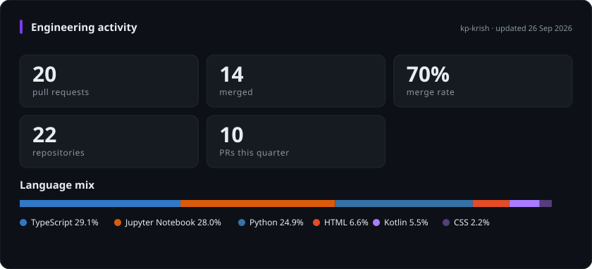

<div align="center">


<a href="https://kp-krish.github.io/KrishPatel"></a>
<a href="https://linkedin.com/in/krish-patel2004"></a>
<a href="mailto:kpate385@asu.edu"></a>

</div>

---

```console
krish@asu:~$ whoami

  role     : Graduate Research Assistant, ASU (Prof. Hasan Davulcu)
  working  : multi-agent LLM pipelines on LangGraph, QLoRA fine-tunes on Sol HPC
  shipping : ClickLess AI (conversational web automation) + Order Ledger (Spring Boot / Kafka)
  seeking  : New Grad SWE / AI Engineer, 2027
  fun_fact : my grandfather farmed cotton in Mehsana, I farm GPU hours in Tempe
```

<!-- Block below is regenerated by .github/workflows/live-stats.yml. Do not edit by hand. -->
<!--START_SECTION:live-->
<div align="center">



<sub>generated by a scheduled GitHub Action, no third party services. last run 15 Sep 2026, 21:22 UTC</sub>

</div>
<!--END_SECTION:live-->

<div align="center">

<picture>
  <source media="(prefers-color-scheme: dark)" srcset="https://raw.githubusercontent.com/kp-krish/kp-krish/output/github-snake-dark.svg" />
  <source media="(prefers-color-scheme: light)" srcset="https://raw.githubusercontent.com/kp-krish/kp-krish/output/github-snake.svg" />
  
</picture>

</div>

## What I'm building

**ClickLess AI** is a conversational agent that drives a real browser. You describe an
outcome, it plans the DOM interactions and executes them. Currently working through
single-model shopping and checkout flows.

**Order Ledger** is an event-sourced order service on Spring Boot, Kafka and Postgres,
with a Kubernetes platform layer going on top of it. Built to actually hit distributed
systems failure modes rather than read about them.

**Research at ASU** covers multi-agent LLM orchestration with LangGraph, retrieval
pipelines, and QLoRA fine-tunes of Mistral-7B on the Sol HPC cluster.

## Stack

<div align="center">


</div>

<div align="center">
<sub>Open to New Grad SWE and AI Engineer roles starting mid-2027.</sub>
</div>